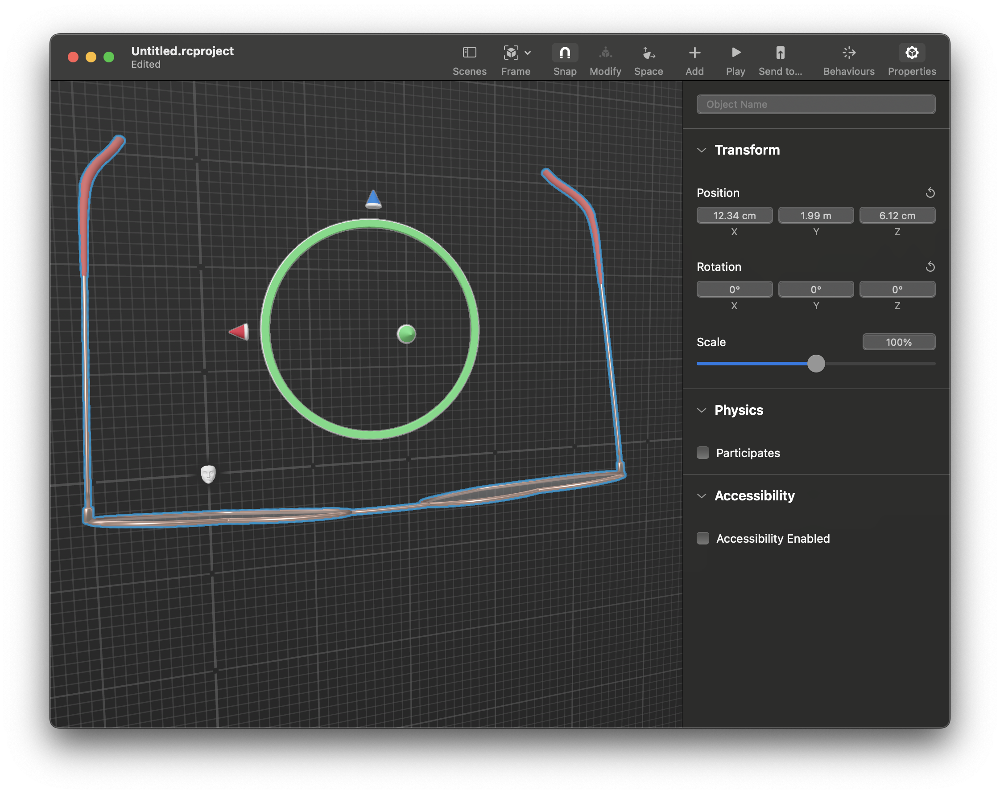
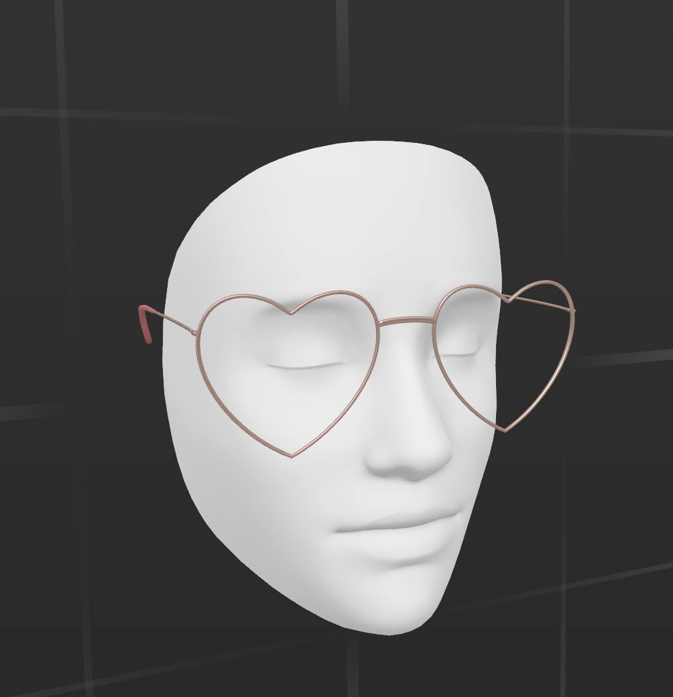

# AR Glasses Try On Concept

This repo contains a Demo project using [ARKit](https://developer.apple.com/documentation/arkit/) and [RealityKit](https://developer.apple.com/documentation/realitykit/) to place a 3D model of a pair of glasses onto the users face.

Acknowledgement: This repo is fork from https://github.com/theappbusiness/ARKit-Glasses.
To learn more about this technology, take a look at this article: https://medium.com/kinandcartacreated/getting-started-with-face-tracking-in-arkit-on-ios-60ada571bcb6

---

https://user-images.githubusercontent.com/45484154/227756652-6c3727b6-f370-448c-be3f-8387c4455194.mp4

## Requirements

- Xcode 13+
- iOS 15+ Device with TrueDepth front facing camera (iPhone X and later) - Does not work in iOS Simulator

---

## Setup

Everything needed to run the project is included in this repo, no further setup is required

---

## Adding additional 3D Models

In order to add additional 3D Models to be used in the app:

- Firstly you will need to source a 3D model (in usdz format) to use (the ones included in the project came from [sketchfab](https://sketchfab.com/feed))
  
  - Something that would be really interesting would be to try and create your own 3D model from photographs using [Object Capture](https://developer.apple.com/news/?id=36zqi3km) and [this command line tool](https://developer.apple.com/documentation/realitykit/creating_a_photogrammetry_command-line_app) (requires macOS 13)
- Once you have a model open up Reality Composer from Xcode
  - From the menu bar click Xcode > Open Developer Tool > Reality Composer
- Select "New Document" or File > New
- Select "Face" anchor and untick "Use template content" the click "Choose"
- You should see a view with a blank face model in the centre
- Change the scene name in the top right from "Scene" to "Face" then drag your usdz model file onto the window to add it to the scene
- You may see something like this: 

- Use the Rotation, Position and Scale values until your model sits nicely on the face where glasses would normally sit:

- Save your scene then add the resulting .rcproject file to the Xcode project
- To use your new scene in the app change this line in ContentView `if let faceScene = try? Glasses.loadFace() {` - replace "Glasses" with the name of your new .rcproject file
- Run the app again and see the new model on your face!
